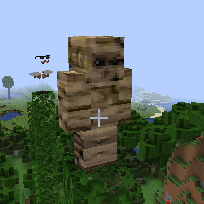
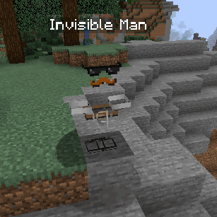

More Creeps and Weirdos Refabricated is an in-progress recreation of the classic [Minecraft](https://www.minecraft.net)
mod [More Creeps and Weirdos](http://morecreeps.com), for [Fabric Mod Loader](https://fabricmc.net).
Please check it out, if you haven't already!

**The source code is not public, for this project, unfortunately.**

According to the [license terms included with the original mod](https://www.minecraftforum.net/forums/mapping-and-modding-java-edition/minecraft-mods/1272354-1-2-5-morecreeps-weirdos-v2-62-slot-machines-old),
creating modified versions for personal use is OK, but redistributing them is not.
I would like to stay on good terms with the author, so I am going to allow him to review it
first, and ask him for permission to release it.


A relevant excerpt from the license terms of the original mod:
```
 3. REDISTRIBUTION
 This MOD may only be distributed where uploaded, mirrored, or otherwise linked to by the OWNER solely.
 All mirrors of this mod must have advance written permission from the OWNER.
 ANY attempts to make money off of this MOD (selling, selling modified versions, adfly, sharecash, etc.) are STRICTLY FORBIDDEN,
 and the OWNER may claim damages or take other action to rectify the situation.
 
 4. DERIVATIVE WORKS/MODIFICATION
 This mod is provided freely and may be decompiled and modified for private use, either with a decompiler or a bytecode editor.
 Public distribution of modified versions of this MOD require advance written permission of the OWNER and may be subject to certain terms.
```




